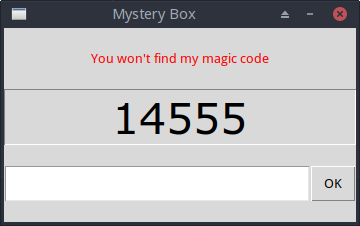
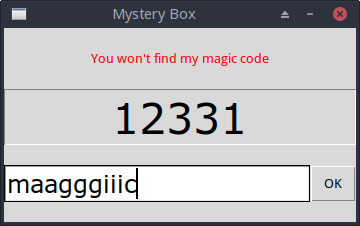

# Magic

Projekt powstał na samym początku nauki programowania z GUI.
Tutaj po raz pierwszy napisałem własną funkcję w osobnym pliku (magic.py) i zaimportowałem ją do drugiego pliku z interfejsem (magic_gui.py).
To była praktyczna lekcja pisania własnych modułów i importowania ich w Pythonie.
Został w oryginalnej formie – bez zmian i bez upiększania.

Prosty skrypt z graficznym interfejsem, który udaje "magiczną" sztuczkę z liczbą.  
Użytkownik widząc losową liczbę, musi odganąć wynik.

W tym projekcie nauczyłem się separacji logiki od interfejsu.

## Co robi

- Losuje 5 cyfr (1–5), które tworzą PIN
- Tworzy "magiczny kod" – litery "m a g i c" powtórzone tyle razy, ile wskazuje cyfra (np. 2 → mm, 1 → a, 3 → ggg itd.)
  
  np. jeśli cyfry to [2,1,3,4,5], PIN = '21345', code = 'mmagggiiiiccccc'
- Wyświetla PIN i prosi o wpisanie kodu 
- Sprawdza, czy wpisany kod zgadza się z wygenerowanym

---

## Zrzuty ekranu





---

## Wymagania

Python 3 + tkinter (standardowa biblioteka)

## Uruchomienie

```bash
python magic_gui.py
```

---

## License

This project is licensed under the MIT License - see the [LICENSE](LICENSE) file.

**Attribution appreciated:** If you use this code, a link back to this repo
would be awesome (but not required). It helps other developers find the original
work and supports independent creators like me.

---

> "Nie jestem programistą z zawodu. Jestem nim z powołania."
